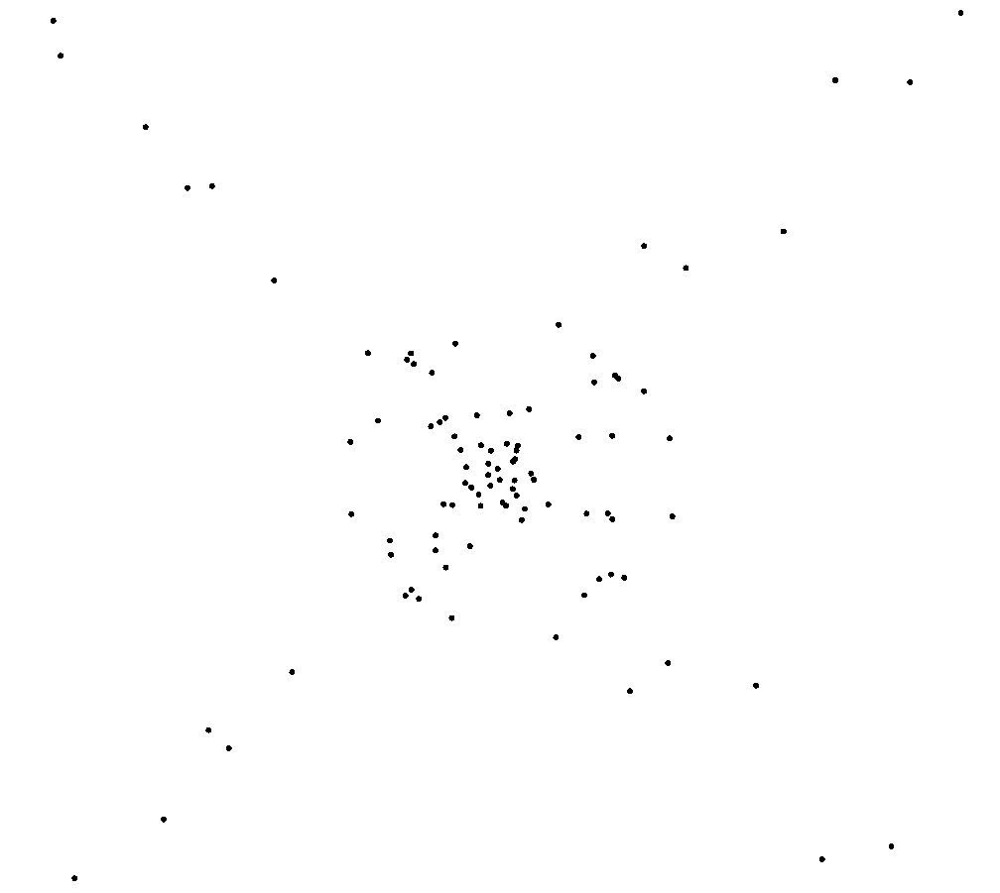

# Law of universal gravitation

## Description
Simulation of universal gravitation aka N-body problem written with SFML.

## Requirements
Microsoft Visual Studio with SFML installed.

## Quick start
1. Open MSVS.
2. Open the solution, `gravity.sln`.
3. Run the game via the debug button.
